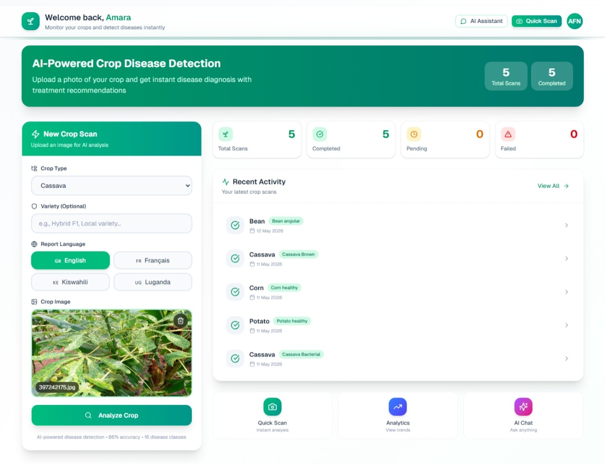
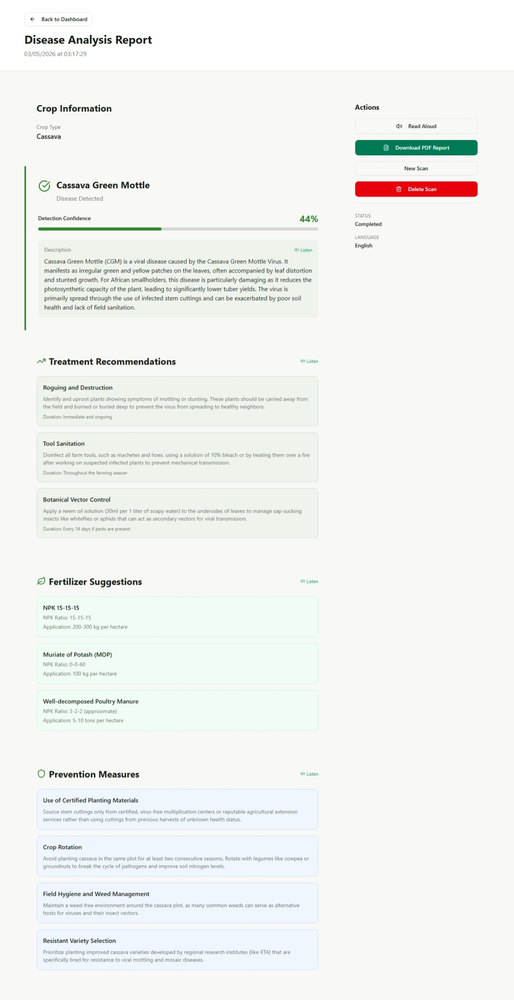
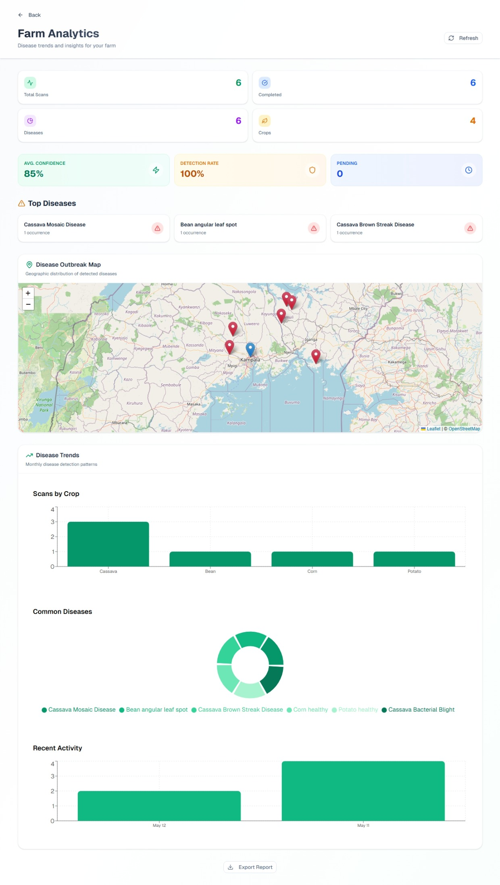

# 🌱 CropGuard AI: Full-Stack Crop Disease Detection Platform

> **From Model to Application** — An end-to-end AI system for crop disease detection, treatment recommendations, and farmer assistance in multiple languages.


---

# 📖 Overview

CropGuard AI is a production-style full-stack agriculture intelligence platform that helps farmers detect crop diseases using AI and receive expert-level treatment recommendations.

It combines:

- 🧠 Deep Learning (MobileNetV3-Small)
- 🤖 Google Gemini AI for agronomic advice
- 📊 Real-time analytics dashboard
- 🔐 Secure authentication system
- 🌍 Multilingual farmer support
- 📄 Automated PDF reporting system

---

# 📸 Screenshots

> Real interface of the CropGuard AI platform

### 🏠 Dashboard


### 🔬 Disease Detection Result


### 📊 Analytics


---

# ✨ Key Features

## 🧠 AI & Machine Learning
- Custom-trained MobileNetV3-Small model
- 16 crop disease classifications
- Grad-CAM explainability heatmaps
- Confidence score prediction
- Async inference pipeline (FastAPI)
- Gemini AI treatment recommendations

## 🔐 Authentication System
- Email/password authentication
- Google OAuth 2.0 login
- JWT session management
- Password reset flow
- Protected routes & middleware
- Multi-step farmer onboarding

## 📸 Image Detection System
- Drag-and-drop image upload
- Image preview & validation
- Async processing with polling
- Retry failed scans
- Real-time detection status

## 📊 Dashboard & Analytics
- Scan history tracking
- Disease statistics visualization
- Crop-based analytics charts
- OpenStreetMap farm mapping
- Real-time scan counters
- Activity timeline

## 🌍 Multilingual Support
Supported languages:
- English 🇬🇧
- French 🇫🇷
- Swahili 🇰🇪
- Luganda 🇺🇬

Features:
- Full UI translation
- AI-generated localized responses
- Text-to-speech support
- Voice-assisted disease reports

## 🤖 AI Advisory System
Gemini AI generates:
- Treatment recommendations (step-by-step)
- Fertilizer suggestions (NPK-based)
- Disease prevention strategies
- Localized farming guidance

## 📄 PDF Report System
- Professional downloadable reports
- Disease diagnosis summary
- Treatment & prevention plan
- Confidence score analysis
- Farmer metadata & timestamps

---

# 📦 Model Download

The trained AI model is hosted externally due to size and ML best practices.

👉 Download model weights:

[](https://drive.google.com/file/d/1sCn79qU2Mtp7Xj8duEI6xnPrs4U2GdYE/view?usp=sharing)

### 📌 Setup Instructions
After downloading, place the model file here:

```text
server/cropguard_model_v1.pth
```

Then restart the FastAPI inference server.

---

# 🏗️ System Architecture

```text
Frontend (React 19)
        ↓
Backend (Express + tRPC)
        ↓
PostgreSQL Database
        ↓
FastAPI AI Inference (PyTorch)
        ↓
Google Gemini AI (Recommendations)
```

---

# 📁 Project Structure

```text
client/               → React frontend (UI & dashboard)
server/               → Express backend (API, auth, AI integration)
data_engineering/     → Dataset preprocessing scripts
training_pipeline/    → Model training & experiments
inference_analysis/   → Grad-CAM explainability
docs/                 → Documentation & reports
```

---

# 🛠️ Tech Stack

| Layer        | Technology |
|--------------|------------|
| Frontend     | React 19, TypeScript, Vite, Tailwind CSS |
| Backend      | Express.js, tRPC |
| Database     | PostgreSQL + Drizzle ORM |
| AI Inference | FastAPI + PyTorch |
| Model        | MobileNetV3-Small |
| AI API       | Google Gemini 2.5 Flash |
| Charts       | Recharts |
| Maps         | Leaflet + OpenStreetMap |
| PDF          | jsPDF |
| Speech       | Web Speech API |

---

# 📦 Installation

## Prerequisites
- Node.js 24+
- Python 3.13+
- PostgreSQL 17+
- pnpm

---

## Setup

```bash
git clone https://github.com/amara2002/CropGuard-AI.git
cd CropGuard-AI

pnpm install
pip install -r requirements.txt
```

---

## Environment Variables

```env
DATABASE_URL=
JWT_SECRET=
GOOGLE_CLIENT_ID=
GOOGLE_CLIENT_SECRET=
GEMINI_API_KEY=
```

---

## Database Setup

```bash
npx drizzle-kit push
```

---

## Run Project

```bash
# Start full-stack app
pnpm dev

# Start AI inference server
cd server
uvicorn main:app --reload --port 8000
```

---

# 📊 Model Performance

| Metric              | Value |
|---------------------|-------|
| Validation Accuracy | 86.03% |
| Training Accuracy   | 85.87% |
| Classes             | 16 |
| Architecture        | MobileNetV3-Small |
| Input Size          | 224×224 |

---

# 🌾 Supported Crops

| Crop    | Diseases |
|---------|----------|
| Bean    | Angular Leaf Spot, Rust, Healthy |
| Cassava | Bacterial Blight, Brown Streak, Mosaic |
| Corn    | Common Rust, Healthy |
| Potato  | Early & Late Blight, Healthy |
| Tomato  | Early & Late Blight, Healthy |

---

# 🔍 Explainability (Grad-CAM)

Grad-CAM analysis shows the model focuses on actual disease regions instead of background noise, improving interpretability and trust for real-world agricultural deployment.

---

# 🧪 Engineering Highlights

- Async AI inference pipeline
- Multi-service architecture (React + Node + FastAPI)
- Secure authentication system
- Real-time dashboard updates
- Grad-CAM explainability
- Multilingual AI generation system

---

# 🔮 Future Improvements

- Progressive Web App (PWA)
- Offline AI inference
- Mobile app (React Native)
- Drone crop monitoring
- IoT sensor integration
- SMS alert system
- Edge AI deployment (Raspberry Pi)

---

# 🧑‍💻 Author

**Amara Nyei**  
MSc IT Candidate | Full-Stack Developer | AI Engineer

GitHub: https://github.com/amara2002

---

# 📄 License

This project is licensed under the MIT License.
